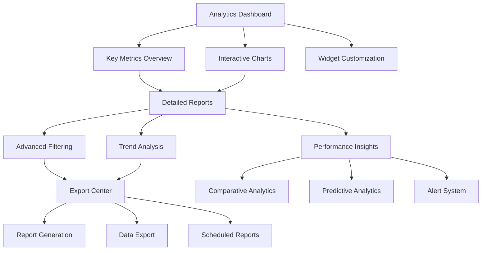

# Enhanced Call Analytics Section - Product Requirements Document

## 1. Product Overview

The Enhanced Call Analytics section provides comprehensive insights into call performance through robust data visualization and reporting functionalities. This section transforms raw call data from VAPI into actionable business intelligence, enabling users to understand call patterns, customer sentiment, lead quality, and operational efficiency.

The system maintains the existing VAPI API → Local Processing → Analytics Display pipeline while significantly enhancing visualization capabilities, filtering options, and export functionalities to deliver enterprise-grade analytics for call center operations.

## 2. Core Features

### 2.1 User Roles

| Role         | Registration Method  | Core Permissions                                                                                            |
| ------------ | -------------------- | ----------------------------------------------------------------------------------------------------------- |
| Free User    | Email registration   | Access to basic analytics with 30-day data retention, standard charts, basic filtering                      |
| Premium User | Subscription upgrade | Full analytics access with unlimited data retention, advanced charts, custom filtering, export capabilities |
| Admin User   | Admin panel access   | All premium features plus user management, system-wide analytics, advanced reporting                        |

### 2.2 Feature Module

Our enhanced call analytics requirements consist of the following main pages:

1. **Analytics Dashboard**: Interactive overview with key metrics, real-time data updates, customizable widget layout
2. **Detailed Reports**: Advanced filtering interface, comprehensive data tables, trend analysis charts
3. **Export Center**: Report generation, data export options, scheduled reports configuration
4. **Performance Insights**: Comparative analytics, benchmarking tools, predictive insights

### 2.3 Page Details

| Page Name            | Module Name           | Feature Description                                                                                                |
| -------------------- | --------------------- | ------------------------------------------------------------------------------------------------------------------ |
| Analytics Dashboard  | Widget Grid System    | AWS-style customizable dashboard with drag-and-drop widgets, resizable containers, and persistent layout preferences |
| Analytics Dashboard  | Key Metrics Widgets   | Individual metric cards (calls, answer rate, duration, cost) as draggable widgets with real-time updates          |
| Analytics Dashboard  | Chart Widgets         | Modular chart components (line, bar, pie, donut) as independent widgets with drill-down capabilities               |
| Analytics Dashboard  | Widget Library        | Add/remove widgets from a comprehensive library including custom KPI widgets and third-party integrations          |
| Analytics Dashboard  | Layout Presets        | Pre-configured dashboard layouts (Executive, Operations, Sales) with one-click switching                           |
| Analytics Dashboard  | Time Range Selector   | Global time filter affecting all widgets with sync capabilities and custom date ranges                             |
| Detailed Reports     | Advanced Filtering    | Filter by date range, call status, sentiment, lead quality, duration, cost with multi-select options               |
| Detailed Reports     | Data Table            | Sortable columns, pagination, search functionality, call detail modal integration                                  |
| Detailed Reports     | Trend Analysis        | Line charts for call volume over time, sentiment trends, cost analysis with comparative periods                    |
| Detailed Reports     | Performance Metrics   | Calculate conversion rates, average handling time, cost per lead, ROI metrics                                      |
| Export Center        | Report Generation     | Generate PDF/Excel reports with custom date ranges, selected metrics, branded templates                            |
| Export Center        | Data Export           | Export raw data in CSV/JSON formats with filtering options and data transformation                                 |
| Export Center        | Scheduled Reports     | Configure automated daily/weekly/monthly reports with email delivery                                               |
| Performance Insights | Comparative Analytics | Compare current period vs previous period, year-over-year analysis, benchmark against industry standards           |
| Performance Insights | Predictive Analytics  | Forecast call volume trends, identify peak hours, predict lead conversion rates                                    |
| Performance Insights | Alert System          | Set up alerts for unusual patterns, performance thresholds, cost limits                                            |

## 2.4 Widget-Based Dashboard Architecture

### 2.4.1 Widget System Overview
The Analytics Dashboard implements a modern widget-based architecture similar to AWS CloudWatch dashboards, providing users with complete control over their analytics experience through customizable, draggable, and resizable components.

### 2.4.2 Available Widget Types

| Widget Type | Description | Size Options | Data Sources |
|-------------|-------------|--------------|-------------|
| Metric Card | Single KPI display with trend indicator | Small (1x1), Medium (2x1) | Real-time call metrics |
| Line Chart | Time-series data visualization | Medium (2x2), Large (4x2) | Call volume, duration trends |
| Bar Chart | Categorical data comparison | Medium (2x2), Large (3x2) | Lead quality, status distribution |
| Pie Chart | Percentage distribution display | Small (2x2), Medium (3x2) | Sentiment analysis, call outcomes |
| Data Table | Tabular data with sorting/filtering | Large (4x3), Extra Large (6x4) | Recent calls, detailed records |
| Heatmap | Time-based activity visualization | Large (4x2) | Call volume by hour/day |
| Gauge | Progress/performance indicators | Small (2x2) | Answer rate, conversion rate |
| Text Widget | Custom notes and annotations | Small (2x1), Medium (3x1) | User-defined content |

### 2.4.3 Dashboard Customization Features

**Drag-and-Drop Interface**
- Intuitive widget repositioning with visual feedback
- Grid-based snapping for precise alignment
- Real-time layout preview during drag operations
- Collision detection and automatic repositioning

**Widget Management**
- Add widgets from comprehensive library panel
- Remove widgets with confirmation dialog
- Duplicate existing widgets with modified configurations
- Widget-specific configuration panels

**Layout Persistence**
- User-specific layout preferences stored in database
- Auto-save functionality with 2-second debounce
- Layout versioning for rollback capabilities
- Export/import layout configurations

**Responsive Behavior**
- Automatic widget reflow on screen size changes
- Mobile-optimized stacked layout
- Breakpoint-specific widget sizing
- Touch-friendly interaction on mobile devices

### 2.4.4 Pre-configured Layout Templates

**Executive Dashboard**
- High-level KPI metrics (4 metric cards)
- Call volume trend chart (large)
- Sentiment distribution pie chart (medium)
- Cost analysis bar chart (medium)

**Operations Dashboard**
- Real-time call status widgets
- Answer rate gauge
- Recent calls data table
- Performance heatmap
- Alert notifications panel

**Sales Dashboard**
- Lead quality distribution
- Conversion rate metrics
- Revenue tracking charts
- Top performing periods analysis
- Goal progress indicators

### 2.4.5 Widget Configuration Options

**Data Refresh Settings**
- Real-time updates (5-second intervals)
- Manual refresh controls
- Auto-refresh toggle per widget
- Data staleness indicators

**Visual Customization**
- Color scheme selection per widget
- Chart type switching for compatible data
- Title and description editing
- Border and shadow styling options

**Data Filtering**
- Widget-specific time range overrides
- Custom filter criteria per widget
- Global filter inheritance options
- Filter synchronization across widgets

## 3. Core Process

### Main User Flow

1. User accesses Analytics Dashboard and views customizable widget-based interface
2. User selects from pre-configured layout templates (Executive, Operations, Sales) or creates custom layout
3. User adds widgets from library panel by dragging desired components to dashboard grid
4. User repositions and resizes widgets using drag-and-drop interface with real-time preview
5. User configures individual widget settings (data sources, refresh rates, visual styling)
6. User applies global time range filters that sync across all compatible widgets
7. User saves custom dashboard layout with auto-persistence and optional naming
8. User drills down into detailed reports from widget interactions
9. User exports widget data or generates comprehensive reports
10. User sets up scheduled reports and performance alerts from widget configurations

### Admin Flow

1. Admin accesses system-wide analytics across all users
2. Admin configures global settings and data retention policies
3. Admin manages user permissions and feature access
4. Admin monitors system performance and API usage

## 4. User Interface Design

### 4.1 Design Style

* **Primary Colors**: Blue (#3B82F6) for primary actions, Green (#10B981) for positive metrics, Red (#EF4444) for alerts

* **Secondary Colors**: Gray (#6B7280) for text, Light Gray (#F3F4F6) for backgrounds, White (#FFFFFF) for cards

* **Button Style**: Rounded corners (8px), subtle shadows, hover animations with color transitions

* **Font**: Inter font family, 14px base size, 16px for headings, 12px for captions

* **Layout Style**: Card-based design with clean spacing, top navigation with breadcrumbs, responsive grid system

* **Icons**: Lucide React icons for consistency, 16px-24px sizes, matching color scheme

### 4.2 Page Design Overview

| Page Name            | Module Name         | UI Elements                                                                                                |
| -------------------- | ------------------- | ---------------------------------------------------------------------------------------------------------- |
| Analytics Dashboard  | Key Metrics Cards   | Clean white cards with colored accent borders, large metric numbers, trend arrows, subtle shadows          |
| Analytics Dashboard  | Interactive Charts  | Chart.js/Recharts components with custom color schemes, hover tooltips, legend controls, responsive sizing |
| Analytics Dashboard  | Time Range Selector | Dropdown with calendar icon, preset options, custom date picker modal                                      |
| Detailed Reports     | Advanced Filtering  | Collapsible filter panel, multi-select dropdowns, date range pickers, clear filters button                 |
| Detailed Reports     | Data Table          | Striped rows, sortable headers with arrows, pagination controls, search input with magnifying glass icon   |
| Export Center        | Report Generation   | Form-based interface with preview, template selection, progress indicators, download buttons               |
| Performance Insights | Comparative Charts  | Side-by-side chart comparisons, percentage change indicators, color-coded improvements/declines            |

### 4.3 Responsiveness

Desktop-first approach with mobile-adaptive design. Touch interaction optimization for mobile devices including:

* Swipeable chart navigation

* Touch-friendly filter controls

* Collapsible sidebar navigation

* Optimized table scrolling

* Mobile-specific chart layouts

