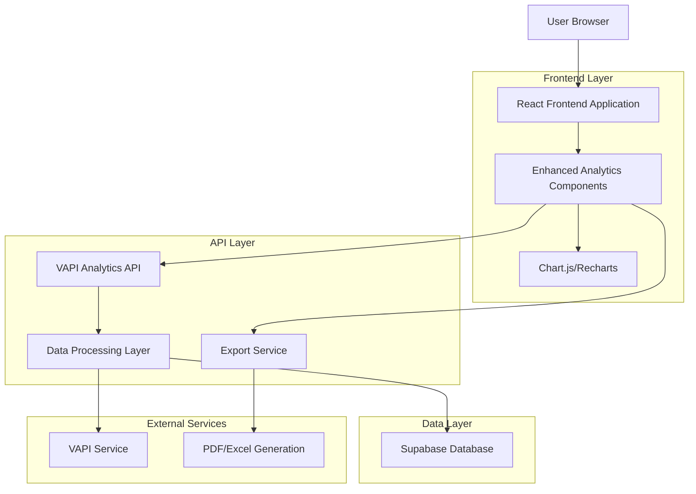
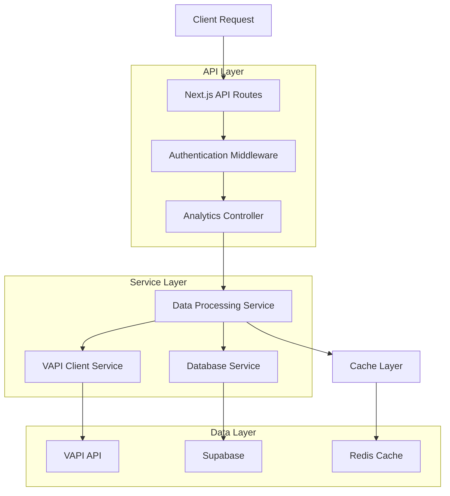
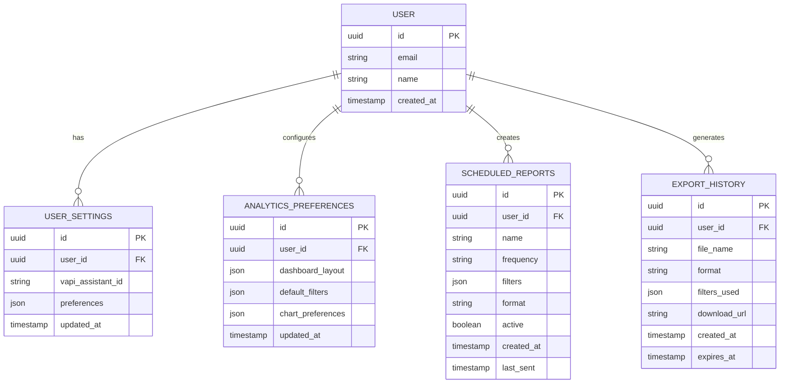

# Enhanced Call Analytics - Technical Architecture Document

## 1. Architecture Design



## 2. Technology Description

* **Frontend**: React\@18 + TypeScript + Tailwind CSS\@3 + Vite

* **Widget System**: React-Grid-Layout\@1.4 + React-Resizable\@3.0 + React-DnD\@16

* **Charts**: Chart.js\@4 + React-Chartjs-2 OR Recharts\@2

* **Data Fetching**: SWR\@2 + React Query\@4 (for real-time updates)

* **State Management**: Zustand\@4 (for widget layout state)

* **Export**: jsPDF\@2 + xlsx\@0.18 + html2canvas\@1

* **Backend**: Next.js\@14 API Routes + Supabase

* **Database**: Supabase (PostgreSQL)

* **External API**: VAPI API for call data

## 2.1 Widget System Architecture

### 2.1.1 Core Widget Components

**Widget Grid Layout Engine**

```typescript
interface WidgetLayout {
  id: string;
  x: number;
  y: number;
  w: number;
  h: number;
  minW?: number;
  minH?: number;
  maxW?: number;
  maxH?: number;
  static?: boolean;
  isDraggable?: boolean;
  isResizable?: boolean;
}

interface DashboardLayout {
  id: string;
  userId: string;
  name: string;
  isDefault: boolean;
  widgets: WidgetLayout[];
  gridCols: number;
  gridRows: number;
  createdAt: Date;
  updatedAt: Date;
}
```

**Widget Component Architecture**

```typescript
interface BaseWidget {
  id: string;
  type: WidgetType;
  title: string;
  config: WidgetConfig;
  dataSource: DataSourceConfig;
  refreshInterval: number;
  lastUpdated: Date;
}

type WidgetType =
  | 'metric-card'
  | 'line-chart'
  | 'bar-chart'
  | 'pie-chart'
  | 'data-table'
  | 'heatmap'
  | 'gauge'
  | 'text-widget';

interface WidgetConfig {
  theme: 'light' | 'dark' | 'auto';
  colors: string[];
  showLegend: boolean;
  showTooltips: boolean;
  customStyles: CSSProperties;
}
```

### 2.1.2 Widget Management System

**Widget Factory Pattern**

* Centralized widget creation and registration

* Type-safe widget instantiation

* Plugin architecture for custom widgets

* Widget validation and error boundaries

**Layout Persistence Service**

```typescript
class LayoutPersistenceService {
  async saveLayout(userId: string, layout: DashboardLayout): Promise<void>;
  async loadLayout(userId: string, layoutId?: string): Promise<DashboardLayout>;
  async deleteLayout(userId: string, layoutId: string): Promise<void>;
  async duplicateLayout(
    userId: string,
    layoutId: string,
    newName: string
  ): Promise<DashboardLayout>;
  async getLayoutTemplates(): Promise<DashboardLayout[]>;
}
```

**Real-time Widget Updates**

* WebSocket connections for live data streaming

* Selective widget refresh based on data dependencies

* Optimistic updates with rollback capabilities

* Bandwidth optimization through data diffing

### 2.1.3 Grid System Implementation

**Responsive Grid Configuration**

```typescript
interface GridBreakpoints {
  lg: { cols: 12; rowHeight: 100 }; // Desktop
  md: { cols: 8; rowHeight: 80 }; // Tablet
  sm: { cols: 4; rowHeight: 60 }; // Mobile
  xs: { cols: 2; rowHeight: 50 }; // Small Mobile
}
```

**Drag and Drop Implementation**

* React-Grid-Layout for grid management

* React-DnD for widget library interactions

* Custom collision detection algorithms

* Smooth animations during layout changes

**Widget Sizing and Constraints**

* Minimum/maximum size enforcement

* Aspect ratio preservation for charts

* Content-aware auto-sizing

* Responsive breakpoint handling

### 2.1.4 Widget Data Management

**Data Source Abstraction**

```typescript
interface DataSource {
  id: string;
  type: 'vapi-analytics' | 'custom-query' | 'static';
  endpoint: string;
  filters: FilterConfig[];
  refreshInterval: number;
  cacheStrategy: 'memory' | 'localStorage' | 'none';
}

interface FilterConfig {
  field: string;
  operator: 'eq' | 'gt' | 'lt' | 'in' | 'between';
  value: any;
  isGlobal: boolean;
}
```

**Widget State Management (Zustand)**

```typescript
interface WidgetStore {
  layouts: Record<string, DashboardLayout>;
  activeLayoutId: string;
  widgets: Record<string, BaseWidget>;
  globalFilters: FilterConfig[];
  isEditMode: boolean;

  // Actions
  setLayout: (layout: DashboardLayout) => void;
  addWidget: (widget: BaseWidget, position: WidgetLayout) => void;
  removeWidget: (widgetId: string) => void;
  updateWidget: (widgetId: string, updates: Partial<BaseWidget>) => void;
  moveWidget: (widgetId: string, newPosition: WidgetLayout) => void;
  setGlobalFilters: (filters: FilterConfig[]) => void;
  toggleEditMode: () => void;
}
```

## 3. Route Definitions

| Route                    | Purpose                                                        |
| ------------------------ | -------------------------------------------------------------- |
| /call-analytics          | Main analytics dashboard with overview metrics and charts      |
| /call-analytics/reports  | Detailed reports page with advanced filtering and data tables  |
| /call-analytics/exports  | Export center for generating and downloading reports           |
| /call-analytics/insights | Performance insights with comparative and predictive analytics |
| /call-analytics/settings | Analytics preferences and dashboard customization              |

## 4. API Definitions

### 4.1 Core API

**Enhanced Analytics Data**

```PowerShell
GET /api/vapi/analytics/enhanced
```

Request:

| Param Name | Param Type | isRequired | Description                                       |
| ---------- | ---------- | ---------- | ------------------------------------------------- |
| days       | number     | false      | Number of days for data range (default: 30)       |
| limit      | number     | false      | Maximum number of calls to analyze (default: 500) |
| filters    | object     | false      | Advanced filtering options                        |
| groupBy    | string     | false      | Group data by hour/day/week/month                 |
| metrics    | string\[]  | false      | Specific metrics to calculate                     |

Response:

| Param Name  | Param Type | Description                                  |
| ----------- | ---------- | -------------------------------------------- |
| metrics     | object     | Enhanced metrics with trends and comparisons |
| chartData   | object     | Formatted data for various chart types       |
| trends      | object     | Trend analysis and predictions               |
| comparisons | object     | Period-over-period comparisons               |

Example:

```json
{
  "metrics": {
    "totalCalls": 150,
    "answerRate": 85.5,
    "avgDuration": 180,
    "totalCost": 45.75,
    "sentimentDistribution": {
      "positive": 65,
      "neutral": 25,
      "negative": 10
    },
    "leadQualityDistribution": {
      "hot": 20,
      "warm": 45,
      "cold": 35
    }
  },
  "chartData": {
    "callVolumeOverTime": [...],
    "sentimentTrends": [...],
    "costAnalysis": [...]
  },
  "trends": {
    "callVolumeChange": "+15%",
    "sentimentImprovement": "+8%",
    "costEfficiency": "-5%"
  }
}
```

**Export Report Generation**

```
POST /api/analytics/export
```

Request:

| Param Name    | Param Type | isRequired | Description                     |
| ------------- | ---------- | ---------- | ------------------------------- |
| format        | string     | true       | Export format (pdf, excel, csv) |
| dateRange     | object     | true       | Start and end dates             |
| filters       | object     | false      | Applied filters                 |
| template      | string     | false      | Report template type            |
| includeCharts | boolean    | false      | Include chart visualizations    |

Response:

| Param Name  | Param Type | Description                     |
| ----------- | ---------- | ------------------------------- |
| downloadUrl | string     | Temporary URL for file download |
| fileSize    | number     | File size in bytes              |
| expiresAt   | string     | URL expiration timestamp        |

**Real-time Analytics Updates**

```
GET /api/analytics/stream
```

Server-Sent Events endpoint for real-time dashboard updates when new calls are processed.

### 4.2 Advanced Filtering API

**Filter Options**

```
GET /api/analytics/filters
```

Returns available filter options based on current data:

* Date ranges

* Call statuses

* Sentiment categories

* Lead quality levels

* Duration ranges

* Cost ranges

## 5. Server Architecture Diagram



## 6. Data Model

### 6.1 Data Model Definition



### 6.2 Widget System Database Schema

**Dashboard Layouts Table (dashboard\_layouts)**

```sql
CREATE TABLE dashboard_layouts (
    id UUID PRIMARY KEY DEFAULT gen_random_uuid(),
    user_id UUID NOT NULL REFERENCES auth.users(id) ON DELETE CASCADE,
    name VARCHAR(100) NOT NULL,
    is_default BOOLEAN DEFAULT false,
    grid_cols INTEGER DEFAULT 12,
    grid_rows INTEGER DEFAULT 20,
    layout_data JSONB NOT NULL, -- Widget positions and configurations
    created_at TIMESTAMP WITH TIME ZONE DEFAULT NOW(),
    updated_at TIMESTAMP WITH TIME ZONE DEFAULT NOW()
);

-- Indexes
CREATE INDEX idx_dashboard_layouts_user_id ON dashboard_layouts(user_id);
CREATE INDEX idx_dashboard_layouts_default ON dashboard_layouts(user_id, is_default) WHERE is_default = true;

-- RLS Policies
ALTER TABLE dashboard_layouts ENABLE ROW LEVEL SECURITY;
CREATE POLICY "Users can manage their own dashboard layouts" ON dashboard_layouts
    FOR ALL USING (auth.uid() = user_id);

-- Grant permissions
GRANT SELECT, INSERT, UPDATE, DELETE ON dashboard_layouts TO authenticated;
```

**Widget Configurations Table (widget\_configs)**

```sql
CREATE TABLE widget_configs (
    id UUID PRIMARY KEY DEFAULT gen_random_uuid(),
    user_id UUID NOT NULL REFERENCES auth.users(id) ON DELETE CASCADE,
    widget_type VARCHAR(50) NOT NULL,
    title VARCHAR(200) NOT NULL,
    config_data JSONB NOT NULL, -- Widget-specific configuration
    data_source_config JSONB NOT NULL, -- Data source and filter settings
    refresh_interval INTEGER DEFAULT 300, -- Seconds
    is_template BOOLEAN DEFAULT false,
    created_at TIMESTAMP WITH TIME ZONE DEFAULT NOW(),
    updated_at TIMESTAMP WITH TIME ZONE DEFAULT NOW()
);

-- Indexes
CREATE INDEX idx_widget_configs_user_id ON widget_configs(user_id);
CREATE INDEX idx_widget_configs_type ON widget_configs(widget_type);
CREATE INDEX idx_widget_configs_template ON widget_configs(is_template) WHERE is_template = true;

-- RLS Policies
ALTER TABLE widget_configs ENABLE ROW LEVEL SECURITY;
CREATE POLICY "Users can manage their own widget configs" ON widget_configs
    FOR ALL USING (auth.uid() = user_id OR is_template = true);

-- Grant permissions
GRANT SELECT, INSERT, UPDATE, DELETE ON widget_configs TO authenticated;
GRANT SELECT ON widget_configs TO anon; -- For template widgets
```

**Layout Templates (Initial Data)**

```sql
-- Executive Dashboard Template
INSERT INTO dashboard_layouts (id, user_id, name, is_default, layout_data) VALUES (
    gen_random_uuid(),
    '00000000-0000-0000-0000-000000000000', -- System template
    'Executive Dashboard',
    false,
    '{
        "widgets": [
            {"id": "total-calls", "x": 0, "y": 0, "w": 3, "h": 2, "type": "metric-card"},
            {"id": "answer-rate", "x": 3, "y": 0, "w": 3, "h": 2, "type": "metric-card"},
            {"id": "avg-duration", "x": 6, "y": 0, "w": 3, "h": 2, "type": "metric-card"},
            {"id": "total-cost", "x": 9, "y": 0, "w": 3, "h": 2, "type": "metric-card"},
            {"id": "call-volume-trend", "x": 0, "y": 2, "w": 8, "h": 4, "type": "line-chart"},
            {"id": "sentiment-distribution", "x": 8, "y": 2, "w": 4, "h": 4, "type": "pie-chart"}
        ]
    }'
);

-- Operations Dashboard Template
INSERT INTO dashboard_layouts (id, user_id, name, is_default, layout_data) VALUES (
    gen_random_uuid(),
    '00000000-0000-0000-0000-000000000000', -- System template
    'Operations Dashboard',
    false,
    '{
        "widgets": [
            {"id": "real-time-status", "x": 0, "y": 0, "w": 4, "h": 3, "type": "data-table"},
            {"id": "answer-rate-gauge", "x": 4, "y": 0, "w": 4, "h": 3, "type": "gauge"},
            {"id": "performance-heatmap", "x": 8, "y": 0, "w": 4, "h": 3, "type": "heatmap"},
            {"id": "recent-calls", "x": 0, "y": 3, "w": 12, "h": 4, "type": "data-table"}
        ]
    }'
);
```

### 6.3 Original Analytics Data Definition Language

**Analytics Preferences Table**

```sql
-- Create analytics preferences table
CREATE TABLE analytics_preferences (
    id UUID PRIMARY KEY DEFAULT gen_random_uuid(),
    user_id UUID NOT NULL REFERENCES auth.users(id) ON DELETE CASCADE,
    dashboard_layout JSONB DEFAULT '{}',
    default_filters JSONB DEFAULT '{}',
    chart_preferences JSONB DEFAULT '{}',
    created_at TIMESTAMP WITH TIME ZONE DEFAULT NOW(),
    updated_at TIMESTAMP WITH TIME ZONE DEFAULT NOW()
);

-- Create index for user lookups
CREATE INDEX idx_analytics_preferences_user_id ON analytics_preferences(user_id);

-- Enable RLS
ALTER TABLE analytics_preferences ENABLE ROW LEVEL SECURITY;

-- RLS policies
CREATE POLICY "Users can view own analytics preferences" ON analytics_preferences
    FOR SELECT USING (auth.uid() = user_id);

CREATE POLICY "Users can update own analytics preferences" ON analytics_preferences
    FOR ALL USING (auth.uid() = user_id);

-- Grant permissions
GRANT SELECT, INSERT, UPDATE, DELETE ON analytics_preferences TO authenticated;
```

**Scheduled Reports Table**

```sql
-- Create scheduled reports table
CREATE TABLE scheduled_reports (
    id UUID PRIMARY KEY DEFAULT gen_random_uuid(),
    user_id UUID NOT NULL REFERENCES auth.users(id) ON DELETE CASCADE,
    name VARCHAR(255) NOT NULL,
    frequency VARCHAR(20) NOT NULL CHECK (frequency IN ('daily', 'weekly', 'monthly')),
    filters JSONB DEFAULT '{}',
    format VARCHAR(10) NOT NULL CHECK (format IN ('pdf', 'excel', 'csv')),
    active BOOLEAN DEFAULT true,
    created_at TIMESTAMP WITH TIME ZONE DEFAULT NOW(),
    last_sent TIMESTAMP WITH TIME ZONE,
    next_send TIMESTAMP WITH TIME ZONE
);

-- Create indexes
CREATE INDEX idx_scheduled_reports_user_id ON scheduled_reports(user_id);
CREATE INDEX idx_scheduled_reports_next_send ON scheduled_reports(next_send) WHERE active = true;

-- Enable RLS
ALTER TABLE scheduled_reports ENABLE ROW LEVEL SECURITY;

-- RLS policies
CREATE POLICY "Users can manage own scheduled reports" ON scheduled_reports
    FOR ALL USING (auth.uid() = user_id);

-- Grant permissions
GRANT ALL PRIVILEGES ON scheduled_reports TO authenticated;
```

**Export History Table**

```sql
-- Create export history table
CREATE TABLE export_history (
    id UUID PRIMARY KEY DEFAULT gen_random_uuid(),
    user_id UUID NOT NULL REFERENCES auth.users(id) ON DELETE CASCADE,
    file_name VARCHAR(255) NOT NULL,
    format VARCHAR(10) NOT NULL,
    filters_used JSONB DEFAULT '{}',
    download_url TEXT,
    file_size BIGINT,
    created_at TIMESTAMP WITH TIME ZONE DEFAULT NOW(),
    expires_at TIMESTAMP WITH TIME ZONE DEFAULT (NOW() + INTERVAL '7 days')
);

-- Create indexes
CREATE INDEX idx_export_history_user_id ON export_history(user_id);
CREATE INDEX idx_export_history_expires_at ON export_history(expires_at);

-- Enable RLS
ALTER TABLE export_history ENABLE ROW LEVEL SECURITY;

-- RLS policies
CREATE POLICY "Users can view own export history" ON export_history
    FOR SELECT USING (auth.uid() = user_id);

CREATE POLICY "System can manage export history" ON export_history
    FOR ALL USING (true);

-- Grant permissions
GRANT SELECT ON export_history TO authenticated;
GRANT ALL PRIVILEGES ON export_history TO service_role;

-- Initial data
INSERT INTO analytics_preferences (user_id, dashboard_layout, default_filters, chart_preferences)
SELECT
    id,
    '{"widgets": ["metrics", "charts", "trends"]}',
    '{"timeRange": "30", "includeTestCalls": false}',
    '{"theme": "default", "animations": true}'
FROM auth.users
WHERE id NOT IN (SELECT user_id FROM analytics_preferences);
```

